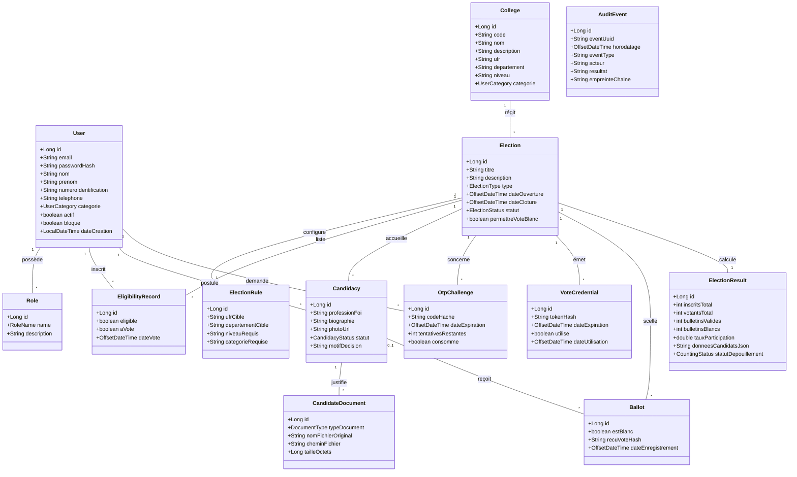

# Diagramme de Classes UML - VoteUASZ

```mermaid
classDiagram
    class User {
        +Long id
        +String email
        +String passwordHash
        +String nom
        +String prenom
        +String numeroIdentification
        +String telephone
        +UserCategory categorie
        +boolean actif
        +boolean bloque
        +LocalDateTime dateCreation
    }

    class Role {
        +Long id
        +RoleName name
        +String description
    }

    class College {
        +Long id
        +String code
        +String nom
        +String description
        +String ufr
        +String departement
        +String niveau
        +UserCategory categorie
    }

    class Election {
        +Long id
        +String titre
        +String description
        +ElectionType type
        +OffsetDateTime dateOuverture
        +OffsetDateTime dateCloture
        +ElectionStatus statut
        +boolean permettreVoteBlanc
    }

    class ElectionRule {
        +Long id
        +String ufrCible
        +String departementCible
        +String niveauRequis
        +String categorieRequise
    }

    class EligibilityRecord {
        +Long id
        +boolean eligible
        +boolean aVote
        +OffsetDateTime dateVote
    }

    class Candidacy {
        +Long id
        +String professionFoi
        +String biographie
        +String photoUrl
        +CandidacyStatus statut
        +String motifDecision
    }

    class CandidateDocument {
        +Long id
        +DocumentType typeDocument
        +String nomFichierOriginal
        +String cheminFichier
        +Long tailleOctets
    }

    class OtpChallenge {
        +Long id
        +String codeHache
        +OffsetDateTime dateExpiration
        +int tentativesRestantes
        +boolean consomme
    }

    class VoteCredential {
        +Long id
        +String tokenHash
        +OffsetDateTime dateExpiration
        +boolean utilise
        +OffsetDateTime dateUtilisation
    }

    class Ballot {
        +Long id
        +boolean estBlanc
        +String recuVoteHash
        +OffsetDateTime dateEnregistrement
    }

    class ElectionResult {
        +Long id
        +int inscritsTotal
        +int votantsTotal
        +int bulletinsValides
        +int bulletinsBlancs
        +double tauxParticipation
        +String donneesCandidatsJson
        +CountingStatus statutDepouillement
    }

    class AuditEvent {
        +Long id
        +String eventUuid
        +OffsetDateTime horodatage
        +String eventType
        +String acteur
        +String resultat
        +String empreinteChaine
    }

    User "1" -- "*" Role : possède
    College "1" -- "*" Election : régit
    Election "1" -- "1" ElectionRule : configure
    Election "1" -- "*" EligibilityRecord : liste
    User "1" -- "*" EligibilityRecord : inscrit
    Election "1" -- "*" Candidacy : accueille
    User "1" -- "*" Candidacy : postule
    Candidacy "1" -- "*" CandidateDocument : justifie
    User "1" -- "*" OtpChallenge : demande
    Election "1" -- "*" OtpChallenge : concerne
    Election "1" -- "*" VoteCredential : émet
    Election "1" -- "*" Ballot : scelle
    Candidacy "0..1" -- "*" Ballot : reçoit
    Election "1" -- "1" ElectionResult : calcule
```
