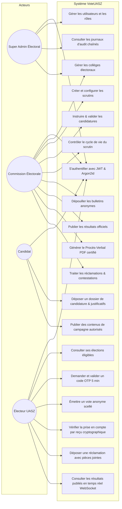

# Diagramme de Cas d'Utilisation UML - VoteUASZ

```mermaid
flowchart LR
    subgraph Acteurs
        SA((Super Admin Électoral))
        CE((Commission Électorale))
        CD((Candidat))
        EL((Électeur UASZ))
    end

    subgraph "Système VoteUASZ"
        UC_Auth[S'authentifier avec JWT & Argon2id]
        UC_Users[Gérer les utilisateurs et les rôles]
        UC_Audit[Consulter les journaux d'audit chaînés]
        
        UC_Colleges[Gérer les collèges électoraux]
        UC_Elections[Créer et configurer les scrutins]
        UC_Review[Instruire & valider les candidatures]
        UC_Lifecycle[Contrôler le cycle de vie du scrutin]
        UC_Count[Dépouiller les bulletins anonymes]
        UC_Publish[Publier les résultats officiels]
        UC_PDF[Générer le Procès-Verbal PDF certifié]
        UC_Resolve[Traiter les réclamations & contestations]

        UC_Apply[Déposer un dossier de candidature & justificatifs]
        UC_Campaign[Publier des contenus de campagne autorisés]

        UC_Eligible[Consulter ses élections éligibles]
        UC_OTP[Demander et valider un code OTP 5 min]
        UC_Vote[Émettre un vote anonyme scellé]
        UC_Receipt[Vérifier la prise en compte par reçu cryptographique]
        UC_Complaint[Déposer une réclamation avec pièces jointes]
        UC_Live[Consulter les résultats publiés en temps réel WebSocket]
    end

    SA --> UC_Auth
    SA --> UC_Users
    SA --> UC_Audit
    SA --> UC_Colleges

    CE --> UC_Auth
    CE --> UC_Colleges
    CE --> UC_Elections
    CE --> UC_Review
    CE --> UC_Lifecycle
    CE --> UC_Count
    CE --> UC_Publish
    CE --> UC_PDF
    CE --> UC_Resolve

    CD --> UC_Auth
    CD --> UC_Apply
    CD --> UC_Campaign

    EL --> UC_Auth
    EL --> UC_Eligible
    EL --> UC_OTP
    EL --> UC_Vote
    EL --> UC_Receipt
    EL --> UC_Complaint
    EL --> UC_Live
```
