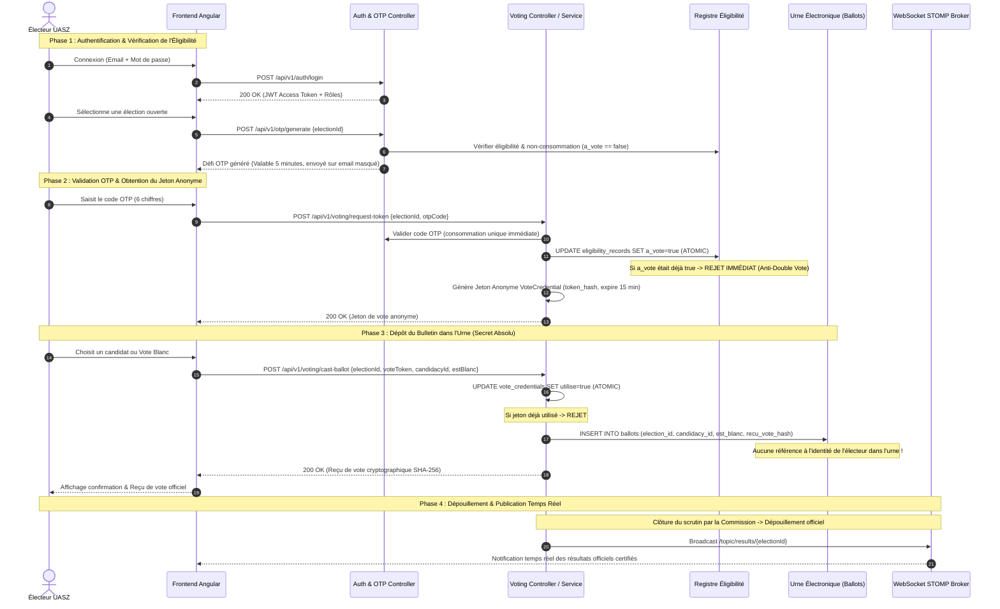

# Diagramme de Séquence UML du Vote Électronique Sécurisé - VoteUASZ

```mermaid
sequenceDiagram
    autonumber
    actor Voter as Électeur UASZ
    participant Frontend as Frontend Angular
    participant Auth as Auth & OTP Controller
    participant Voting as Voting Controller / Service
    participant Elig as Registre Éligibilité
    participant Urn as Urne Électronique (Ballots)
    participant WS as WebSocket STOMP Broker
    
    Note over Voter,Frontend: Phase 1 : Authentification & Vérification de l'Éligibilité
    Voter->>Frontend: Connexion (Email + Mot de passe)
    Frontend->>Auth: POST /api/v1/auth/login
    Auth-->>Frontend: 200 OK (JWT Access Token + Rôles)
    
    Voter->>Frontend: Sélectionne une élection ouverte
    Frontend->>Auth: POST /api/v1/otp/generate {electionId}
    Auth->>Elig: Vérifier éligibilité & non-consommation (a_vote == false)
    Auth-->>Frontend: Défi OTP généré (Valable 5 minutes, envoyé sur email masqué)
    
    Note over Voter,Frontend: Phase 2 : Validation OTP & Obtention du Jeton Anonyme
    Voter->>Frontend: Saisit le code OTP (6 chiffres)
    Frontend->>Voting: POST /api/v1/voting/request-token {electionId, otpCode}
    Voting->>Auth: Valider code OTP (consommation unique immédiate)
    Voting->>Elig: UPDATE eligibility_records SET a_vote=true (ATOMIC)
    Note over Elig: Si a_vote était déjà true -> REJET IMMÉDIAT (Anti-Double Vote)
    Voting->>Voting: Génère Jeton Anonyme VoteCredential (token_hash, expire 15 min)
    Voting-->>Frontend: 200 OK (Jeton de vote anonyme)
    
    Note over Voter,Urn: Phase 3 : Dépôt du Bulletin dans l'Urne (Secret Absolu)
    Voter->>Frontend: Choisit un candidat ou Vote Blanc
    Frontend->>Voting: POST /api/v1/voting/cast-ballot {electionId, voteToken, candidacyId, estBlanc}
    Voting->>Voting: UPDATE vote_credentials SET utilise=true (ATOMIC)
    Note over Voting: Si jeton déjà utilisé -> REJET
    Voting->>Urn: INSERT INTO ballots (election_id, candidacy_id, est_blanc, recu_vote_hash)
    Note over Urn: Aucune référence à l'identité de l'électeur dans l'urne !
    Voting-->>Frontend: 200 OK (Reçu de vote cryptographique SHA-256)
    Frontend-->>Voter: Affichage confirmation & Reçu de vote officiel
    
    Note over Voter,WS: Phase 4 : Dépouillement & Publication Temps Réel
    Note over Voting,WS: Clôture du scrutin par la Commission -> Dépouillement officiel
    Voting->>WS: Broadcast /topic/results/{electionId}
    WS-->>Frontend: Notification temps réel des résultats officiels certifiés
```
